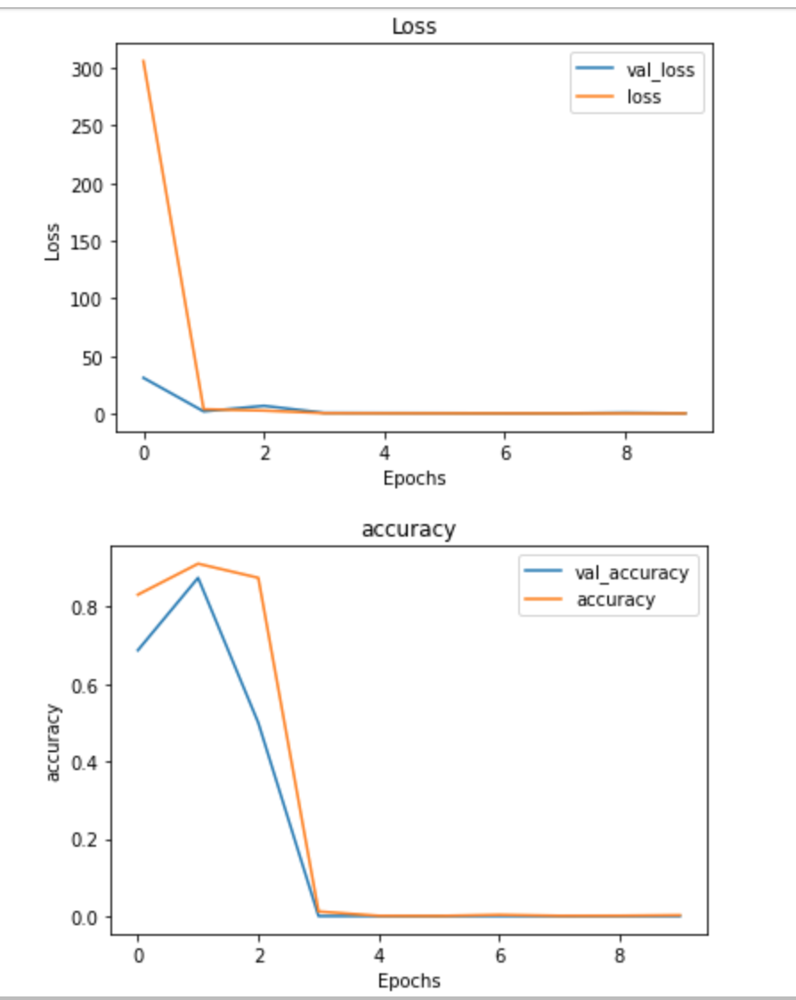
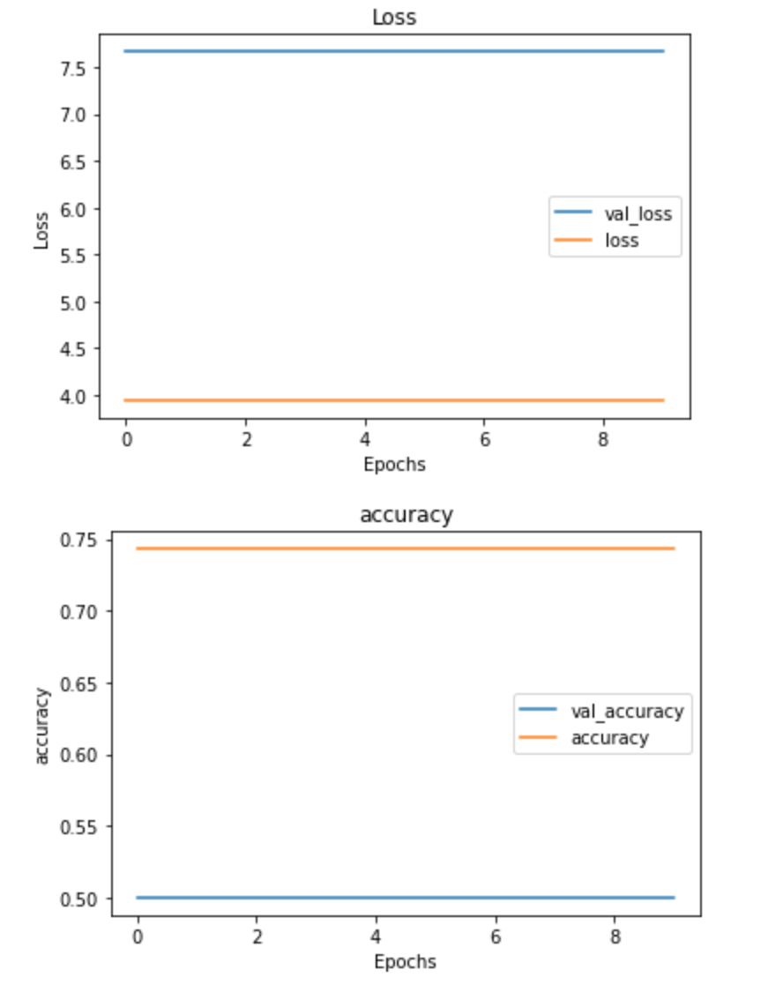

# Mod-4-Project

Guide

The presentation, saved as a pdf can be found in the presentation folder. In the static folder you will find the 
visualizations. The data folder is where you can find the chest x-rays. The final notebook is in the final notebook
folder. 

As covid continues to ravage the USA, the country is seeing the convergence of two critical problems. One, many Americans who live in remote and rural areas, don't have access to quality care,and two, due to Covid, which attacks the lungs, pneumonia cases are skyrocketing. Thus, the goal for this project is to develop a neural network model that can accurately detect pneumonia in the lungs. 

This project relies on a data set of thousanda of images from the Guangzhou Women's and Childredn Medical Center in China. The images are separated into the Train, Test, and Validation sets, and are then split up between X-rays of normal lungs i.e NORMAL and ones infected by pneumonia i.e. PNEUMONIA. 

Here are two examples. The top x ray is of a healthy lung, the bottom is of one infected with pneumonia. 

[Infected Lungs](data/chest_xray/train/PNEUMONIA/person1_bacteria_1.jpeg)

Instructions: 

Install Tensorflow
Install Keras
Update Sklearn 

Going forward: Obviously, I was not nearly as successful as I would have liked, so I need to spend a lot more time iterating, perhaps even starting from a scratch baseline model, since it appears that my model may have gotten a bug and could not evolve. Further, I would love to go back and clean some of the data by hand. 

